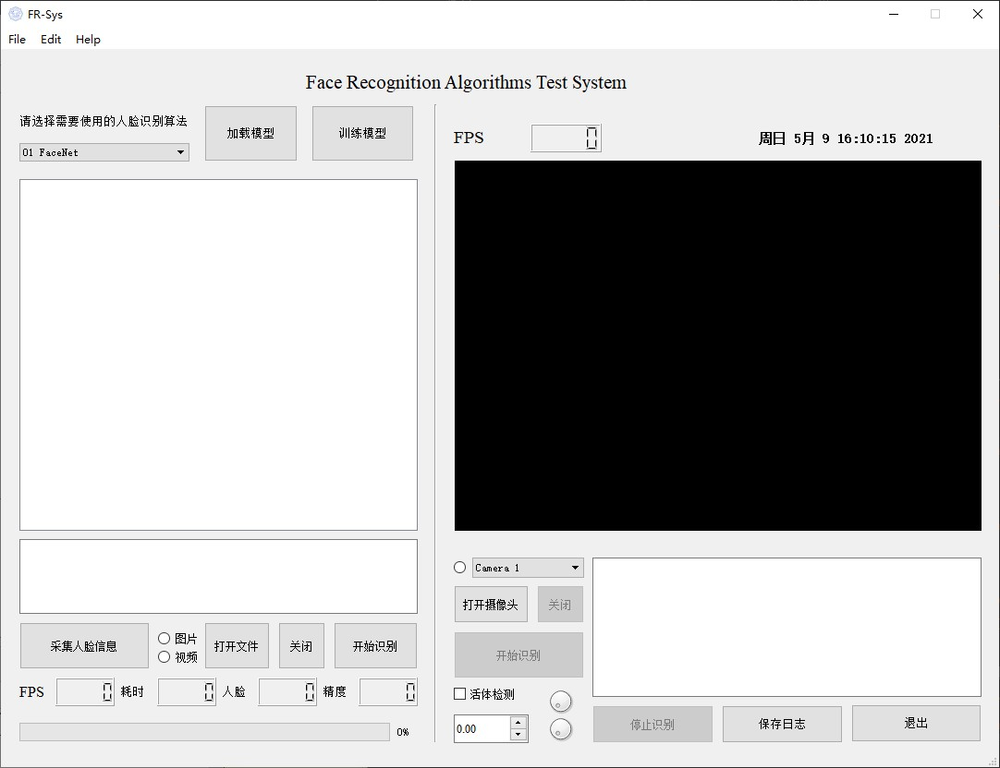

# Face Recognition Algorithms Test System
---
> contributer: datamonday
>
> github: https://github.com/datamonday/FR-AttSys

---
> Reference:
>
> 1. [PyQt5控制摄像头在Qlabel上显示](https://www.cnblogs.com/wxt51/p/10100725.html)
> 2. [ OpenCV读取摄像头卡顿](https://blog.csdn.net/lunweiwangxi3/article/details/88556911)
> 3. [PyQt5 实现视频播放器 ](https://blog.csdn.net/u012552296/article/details/89295273)
> 4. [PyQt5播放实时视频流或本地视频文件](https://www.cnblogs.com/huluwa508/p/10320027.html)
> 5. [PyQt5文件对话框QFileDialog](https://blog.csdn.net/humanking7/article/details/80546728)
> 6. [PyQt5获取摄像头并实时控制人脸](https://zhuanlan.zhihu.com/p/77278306)
> 7. [PyQt5实现图片查看器](https://www.jb51.net/article/185115.htm)
> 8. [PyQt打造图片浏览器](https://blog.csdn.net/lingyunxianhe/article/details/95185992)
> 9. [QTimer和QLabel显示视频文件](https://www.jianshu.com/p/63f8b208662a)

